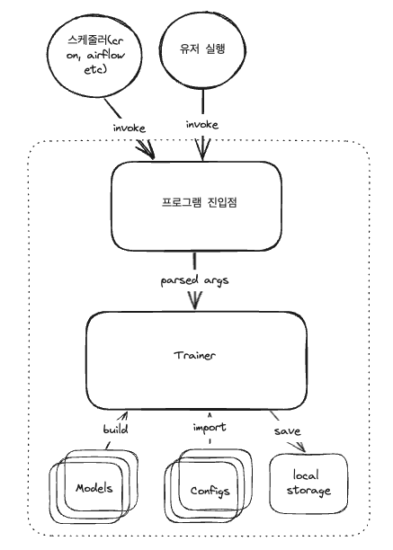

## Pytorch 모델 학습 과정
### Logical Flow


### Pseudo Code
```
# 필요한 패키지 import

# hyperparameter 선언
# 선언한 hyperparameter 를 저장

# 데이터 불러오기
# dataset 만들기 & 전처리하는 코드
# dataloader 만들기

# AI 모델 설계도 만들기 (class)
	# init, forward 구현하기

# AI 모델 객체 생성 (과정에서 hyperparameter 사용)
# loss 객체 생성
# optimizer 객체 생성

# ------- 준비단계 끝 -------- 
# ------- 학습단계 시작 -------- 

# loop 돌면서 학습 진행
    # [epoch]을 학습하기 위해 batch 단위로 데이터를 가져와야함
    # 이 과정이 loop 로 진행
        # dataloader 가 넘겨주는 데이터를 받아서

        # ai 모델에게 넘겨주고
        # 출력물을 기반으로 loss 를 계산하고
        # loss 를 바탕으로 Optimization 을 진행

        # 특정 조건을 제시해서, 그 조건이 만족한다면 학습의 중간 과정을 확인
            # 평가를 진행
            # 보고 싶은 수치 확인(loss, 평가 결과 값, 이미지와 같은 meta-data 등)
            # 만약 평가 결과가 괜찮으면
                # 모델 저장
```

### Pseudo Code(k-fold)

```
# 패키지 import

# hyperparameter 설정
# hyperparameter 저장

# 데이터 불러오기
# 전처리하는 코드

# AI 모델 설계도 만들기 (class)
    # init, forward 구현하기

# ------- 준비단계 끝 --------
# ------- 학습단계 시작 --------

# 학습과 평가를 위한 kfold 객체 생성(n_splits)
# n_splits 만큼 AI 모델 객체 생성 (과정에서 hyperparameter 사용)

# loop 돌면서 학습 및 교차검증
    # kfold 객체로부터 train, validation 데이터를 받아옴
    # train, validation dataset 만들기
    # train, validation dataloader 만들기

    # loss 객체 생성
    # optimizer 객체 생성

    # train dataloader 로부터 데이터를 받아서
    # ai 모델에게 넘겨주고 loss 를 계산

    # validation dataloader 로부터 데이터를 받아서
    # (학습이 진행된) ai 모델에게 넘겨주고 loss_val 를 계산

    # loss, loss_val 을 기반으로 평가 진행
        # 보고 싶은 수치 확인(loss, 평가 결과 값, 이미지와 같은 meta-data 등)

# 평가 결과가 괜찮으면(조건 만족)
    # 모델 저장
```

<br>
<br>

## Pytorch 모델 추론 과정


-------

## 프로그램 도식



--------

## Runner Sample(launch.json)

```
{
    "version": "0.2.0",
    "configurations": [
        {
            "name": "Python: Current File",
            "type": "python",
            "request": "launch",
            "program": "${file}",
            "console": "integratedTerminal",
            "justMyCode": true
        },
        {
            "name": "Python: train",
            "type": "python",
            "request": "launch",
            "program": "${workspaceFolder}${pathSeparator}bin${pathSeparator}train",
            "console": "integratedTerminal",
            "justMyCode": true,
            "args": [
                "--mode=train",
                "--config-dir=config/20231211_final",
            ]
        },
        {
            "name": "Python: validate",
            "type": "python",
            "request": "launch",
            "program": "${workspaceFolder}${pathSeparator}bin${pathSeparator}train",
            "console": "integratedTerminal",
            "justMyCode": true,
            "args": [
                "--mode=validate",
                "--config-dir=config/20231211_final",
            ]
        },
        {
            "name": "Python: test",
            "type": "python",
            "request": "launch",
            "program": "${workspaceFolder}${pathSeparator}bin${pathSeparator}train",
            "console": "integratedTerminal",
            "justMyCode": true,
            "args": [
                "--mode=test",
                "--config-dir=config/20231211_final",
                "--config-name=train_X_231211_final_col_01_transformed",
                "--model-path=output/train_X_231211_final_col_01_transformed_202312120307.pth",
            ]
        }
    ]
}
```